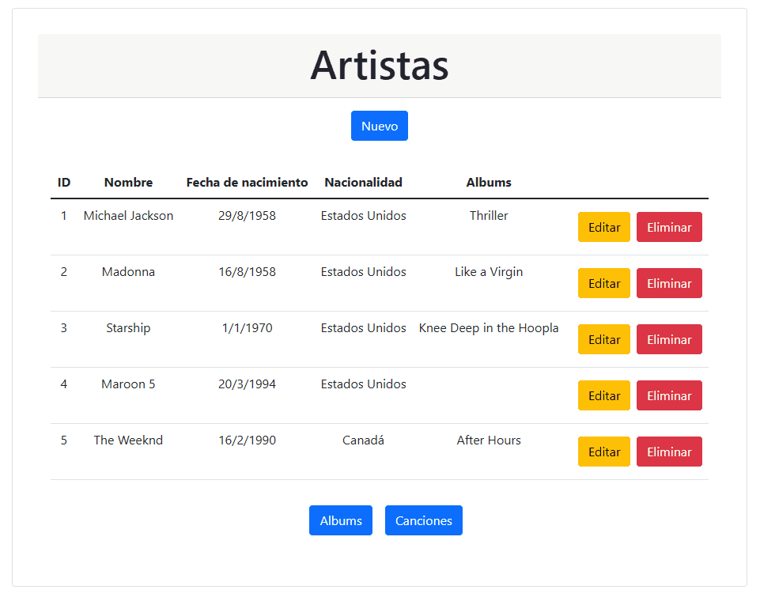

# CRUD Discografía :cd:

## Descripción :page_facing_up:

Este proyecto consiste en una aplicación backend desarrollada para gestionar una discografía. Permite realizar operaciones CRUD (Crear, Leer, Actualizar y Eliminar) sobre registros de tres tablas: Artistas, Albums y Canciones.

### Tecnologías :gear:
- **Java**: Lenguaje de programación.
- **Spring Boot**: Framework para simplificar la configuración y el desarrollo de nuevas aplicaciones Spring.
- **Oracle Database 11g**: Sistema de gestión de base de datos que utiliza el modelo relacional.

## Instalación :wrench:

### Requisitos
- Java 11 o superior
- Maven (opcional)
- IDE de tu preferencia (por ejemplo, Eclipse)
- Oracle Database 11g

## Uso :computer:

1. Clona el repositorio en tu máquina local.
2. Abre el proyecto en tu IDE preferido.
3. Asegúrate de tener configurado correctamente tu ambiente de Oracle Database.
4. Ejecuta el proyecto desde tu IDE o mediante la línea de comandos con Maven.

## Contáctame :mailbox_with_mail:

| &nbsp;       | &nbsp;                                               |
| ------------ | ---------------------------------------------------- |
| **GitHub**   | [@fabi4c](https://github.com/fabri4c)               |
| **LinkedIn** | [@fabri4c](https://www.linkedin.com/in/fabri4c/)     |
| **Twitter**  | [@fabri_4c](https://twitter.com/fabri_4c)            |

## Pruebas :bar_chart:

Aún no se han implementado pruebas para este proyecto.

## Licencia :balance_scale:

Este proyecto está licenciado bajo la [Unilicencia](https://unlicense.org), lo que significa que puedes usarlo sin ninguna restricción.

## Contribuciones :handshake:

Se aceptan contribuciones a este proyecto. Por favor, contáctame para obtener más información.

## Agradecimientos :heart:

[ENUCOM](https://enucom.com.mx/)
